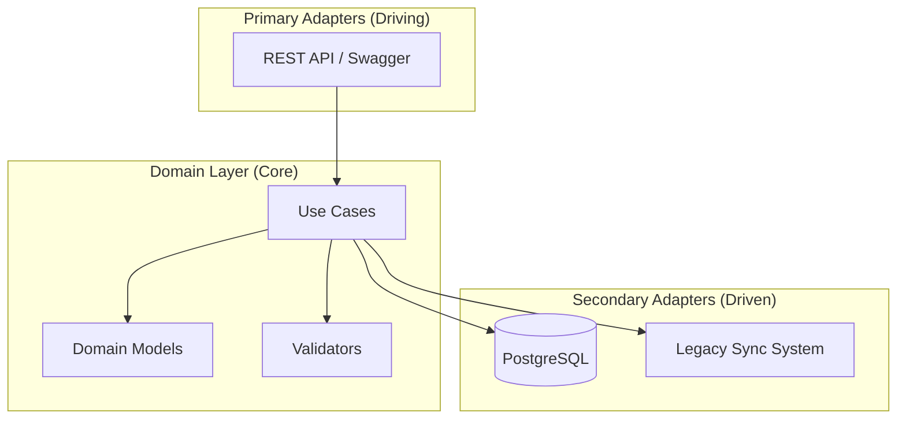

# Warehouse & Store Fulfillment System (Technical Assessment)

## Overview
This repository contains a reference implementation for a **Warehouse Management & Store Fulfillment System**. The primary goal is to demonstrate a robust, scalable architecture capable of handling complex domain rules (capacity, product limits) and legacy system integration without coupling.

The system is built using **Quarkus 3.x** and adheres to **Domain-Driven Design (DDD)** principles, structured as a **Modular Monolith**.

---

## 🏗 Architecture & Design Decisions

### 1. Pattern: Modular Monolith with Hexagonal Architecture
**Context**: The requirement involves distinct but related domains (Warehouse, Store, Fulfillment) with moderate complexity.
**Decision**: Adopted a **Modular Monolith** approach with strictly enforced package boundaries. The **Warehouse** module specifically utilizes **Hexagonal Architecture (Ports & Adapters)** to isolate business logic from infrastructure.



### 2. Legacy Integration: Transaction-Aware Events
**Context**: Store updates must be synchronized to a slow, file-based Legacy System.
**Decision**: Used **CDI Events** with `@Observes(during = TransactionPhase.AFTER_SUCCESS)`.
**Benefit**: Guarantees that the legacy system is only notified if the database transaction commits successfully, preventing data drift between systems without blocking the API response or affecting performance with slow I/O.

### 3. Business Rule Enforcement: Strategy Pattern
**Context**: Warehouses have varying capacity and stock rules.
**Decision**: Implemented a `WarehouseValidator` interface using the **Strategy Pattern**.
**Benefit**: Decouples validation logic from the main entity lifecycle and use cases, making the system compliant with the **Open/Closed Principle**.

---

## ✅ Completed Tasks

- **Task 1: Location Resolution** — Implemented identifier-based lookup in `LocationGateway`.
- **Task 2: Transactional Store Sync** — Decoupled legacy updates via CDI Events to ensure transactional integrity.
- **Task 3: Warehouse Lifecycle** — Implemented Create, Replace, and Archive use cases with validations for:
    - Business Unit Code (BUC) Uniqueness.
    - Location-specific Capacity and Stock limits.
    - Replacement logic (Stock matching and capacity accommodation).
- **Bonus: Fulfillment Module** — Orchestrated Product-Warehouse-Store associations with cross-domain constraint checks.

---

## 📝 Architectural Reasoning
Detailed answers regarding Database patterns, API Strategy (Contract-First vs Code-First), and Testing Strategy can be found in the dedicated questions file:
👉 **[QUESTIONS.md](./ingka-java-code-assignment/QUESTIONS.md)**

---

## 🚀 How to Run

### Requirements
*   JDK 17+
*   Maven 3.8+
*   Docker & Docker Compose

### Local Development (Quarkus Dev Mode)
```bash
cd ingka-java-code-assignment
./mvnw clean quarkus:dev
```

### Running with Docker Compose (Full Stack)
1.  **Build the application**:
    ```bash
    cd ingka-java-code-assignment
    ./mvnw clean package -DskipTests
    cd ..
    ```
2.  **Start the services**:
    ```bash
    docker-compose up --build -d
    ```
3.  **Access the application**:
    *   API: `http://localhost:8080`
    *   Swagger UI: `http://localhost:8080/q/swagger-ui`
    *   Database: `localhost:15432`

---

## 🧪 Testing Strategy
Our testing strategy follows the **Test Pyramid**, aiming for high confidence with minimal feedback loops:

*   **Unit Tests (JUnit 5 + Mockito)**: Focus on the **Domain Layer**. Verify business invariants (e.g., `WarehouseBusinessValidator`) without loading the framework context.
*   **Integration Tests (`@QuarkusTest`)**: Focus on the **Adapter Layer**. Verify REST endpoints, JSON mapping, and Repository interactions with the database (H2).
*   **Code Coverage**: Reports are generated via **JaCoCo**.
```bash
cd ingka-java-code-assignment
./mvnw test
# Report: target/jacoco-report/index.html
```
